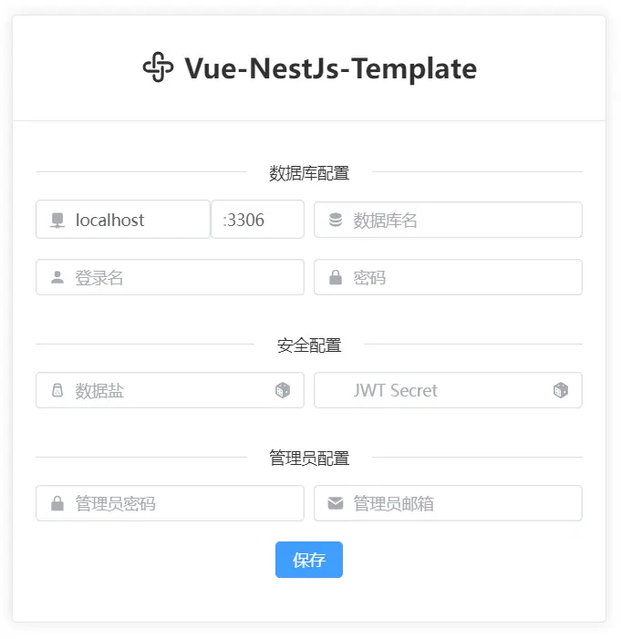

<p align="center">
  <a href="https://hancel.org">
    
  </a>
</p>

<h1 align="center">Vue3 + NestJs Web App Template</h1>

基于 Vue3 和 NestJs 的 Web 应用模板，包含前端和后端。

## 🐞 开发调试

``` bash
# 安装后端依赖
npm install

# 安装前端依赖
cd front && npm install

# 运行前端
npm run dev

```

vscode 按下 F5 运行调试后端或运行 `npm run start`


## 🔨 编译发布

1. 编译生成  
``` bash
# 安装后端依赖
npm install

# 安装前端依赖
cd front && npm install

# 回到后端目录
cd ..

# 编译生成运行文件，输出到 dist 目录
npm run build

```

2. 发布部署  
  将 `package.json` 和  `dist` 目录发布到服务器，运行 `npm install` 安装依赖，运行 `node dist/main.js` 启动服务。  
  启动服务后，访问 `http://localhost:7894` 即可。可以通过环境变量 `PORT` 修改端口。

3. 配置服务  
  首次访问需配置服务，包含数据库信息，安全配置和管理员密码。  
  

可以通过 PM2 以守护进程方式启动：
  
``` bash
npm install pm2 -g
pm2 start -n app_name node -- dist/main.js
```